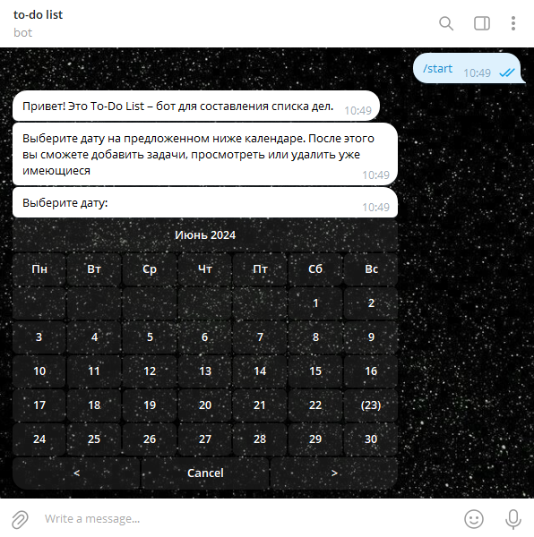
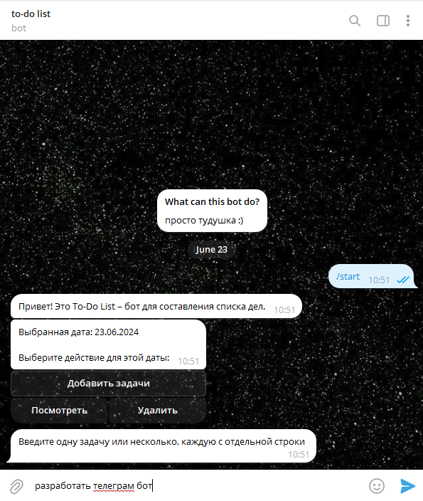
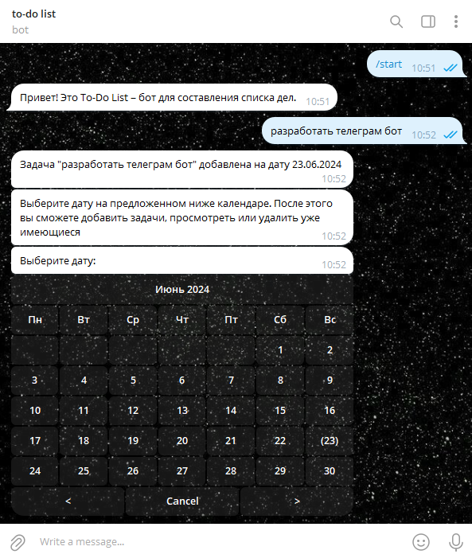

# Телеграм бот To-Do List с календарем
Бот написан с использованием библиотек telebot и telebot-calendar

### Функционал
Бот цикличен. При его запуске предлагается выбрать дату на **календаре** для дальнейшей работы. После выбора даты появляется сообщение со **встроенными кнопками**: можно добавить задачи на эту дату, посмотреть или очистить уже имеющиеся. Можно добавить как одну задачу за раз, так и несколько (каждая с отдельной строки). После осуществления выбранного дейтсвия бот вновь присылает сообщение с календарем.

Все "ненужные" сообщения бота **удаляются** автоматически после проведения действий.

### Пример работы бота:

**Выбор даты**

**Удаление предыдущего сообщения и переход к всроенным кнопкам**

**Запрос задачи у пользователя**

**Добавление задачи, удаление "ненужных" сообщений и переход к календарю**

